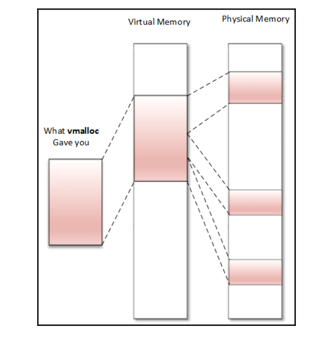

<h1> Kernel Memory Management </h1>

1. System memory layout – kernel space and user space

    On Linux systems, each process owns a virtual address space. That address space is 4 GB in size on 32-bit systems . For each process, that 4 GB address space is split into two parts:
    User space virtual addresses
    Kernel space virtual addresses
- Kernel addresses – concept of low and high memory

    The virtual address space of the kernel (1 GB sized in a 3G/1G split) is divided into two parts : 

    Low memory or LOWMEM, which is the first 896 MB

    High memory or HIGHMEM, represented by the top 128 MB

    - Low memory

        We can then identify three different memory zones in the kernel space:

        ZONE_DMA:This contains page frames of memory below 16 MB, reserved for Direct Memory Access (DMA)

        ZONE_NORMAL:This contains page frames of memory above 16 MB and below 896 MB, for normal use

        ZONE_HIGHMEM: : This contains page frames of memory at and above 896 MB

    - High memory

- User space addresses

    In this section, we will deal with the user space by means of processes. Each process is
    represented in the kernel as an instance of struct task_struct.
    ```
    struct mm_struct {
        struct vm_area_struct *mmap;
        struct rb_root mm_rb;
        unsigned long mmap_base;
        unsigned long task_size;
        unsigned long highest_vm_end;
        pgd_t * pgd;
        atomic_t mm_users;
        atomic_t mm_count;
        atomic_long_t nr_ptes;
        #if CONFIG_PGTABLE_LEVELS > 2
        atomic_long_t nr_pmds;
        #endif
        int map_count;
        spinlock_t page_table_lock;
        struct rw_semaphore mmap_sem;
        unsigned long hiwater_rss;
        unsigned long hiwater_vm;
        unsigned long total_vm;
        unsigned long locked_vm;
        unsigned long pinned_vm;
        unsigned long data_vm;
        unsigned long exec_vm;
        unsigned long stack_vm;
        unsigned long def_flags;
        unsigned long start_code, end_code, start_data, end_data;
        unsigned long start_brk, brk, start_stack;
        unsigned long arg_start, arg_end, env_start, env_end;
        /* Architecture-specific MM context */
        mm_context_t context;
        unsigned long flags;
        struct core_state *core_state;
        #ifdef CONFIG_MEMCG
        /*
        * "owner" points to a task that is regarded as the canonical
        * user/owner of this mm. All of the following must be true in
        * order for it to be changed:
        *
        * current == mm->owner
        * current->mm != mm
        * new_owner->mm == mm
        * new_owner->alloc_lock is held
        */
        struct task_struct __rcu *owner;
        #endif
        struct user_namespace *user_ns;
        /* store ref to file /proc/<pid>/exe symlink points to */
        struct file __rcu *exe_file;
    };
    ```

- Virtual memory area (VMA)

2. Address translation and MMU

- Page lookup and TLB

3. Memory allocation mechanism


- Page allocator

    The page allocator is the lowest level allocator on the Linux system.
    A page frame is represented in the kernel as an instance of the struct page structure
    
    - Page allocation API

    - Conversion functions

- Slab allocator

    - The buddy algorithm

    - A journey into the slab allocator

- kmalloc family allocation

    kmalloc is a kernel memory allocation function
    Memory returned by kmalloc is contiguous in physical memory and in virtual memory.

    
    ```
    void *kmalloc(size_t size, int flags);
    ```
    size specifies the size of the memory to be allocated (in bytes)

    flag determines how and where memory should be allocated

    GFP_KERNEL: This is the standard flag. We cannot use this flag in the interrupt handler because its code may sleep . It always returns memory from the LOM_MEM zone 

    GFP_ATOMIC: This guarantees the atomicity of the allocation. The only flag to use when we are in the interrupt context .Not abuse this ,since it uses an emergence pool of memory

    GFP_USER: This allocates memory to a user space process. Memory is then distinct and separated from that allocated to the kernel.

    GFP_HIGHUSER: This allocates memory from the HIGH_MEMORY zone

    GFP_DMA: This allocates memory from DMA_ZONE

    On successful allocation of memory, kmalloc returns the virtual address of the chunk
    allocated, guaranteed to be physically contiguous. On error, it returns NULL.

    The kfree function is used to free the memory allocated by kmalloc:
    ```
    void kfree(const void *ptr)
    ```
    Other family-like functions are:
    ```
    void kzalloc(size_t size, gfp_t flags);
    void kzfree(const void *p);
    void *kcalloc(size_t n, size_t size, gfp_t flags);
    void *krealloc(const void *p, size_t new_size, gfp_t flags);
    ```


- vmalloc allocator

    vmalloc is a kernel memory allocation function
    It returns memory only contiguous in virtual space (not physically contiguous).

    

- Process memory allocation under the hood

4. Working with I/O memory to talk with hardware

- PIO devices access

    Port Input Output (PIO) --> x86 architectures

- MMIO device access

    Memory Mapped Input Output (MMIO) -->  ARM architectures

5. Memory (re)mapping

- kmap

- Mapping kernel memory to user space

6. Linux caching system

- What is a cache?

- Why delay writing data to disk?

7. Device-managed resources – Devres