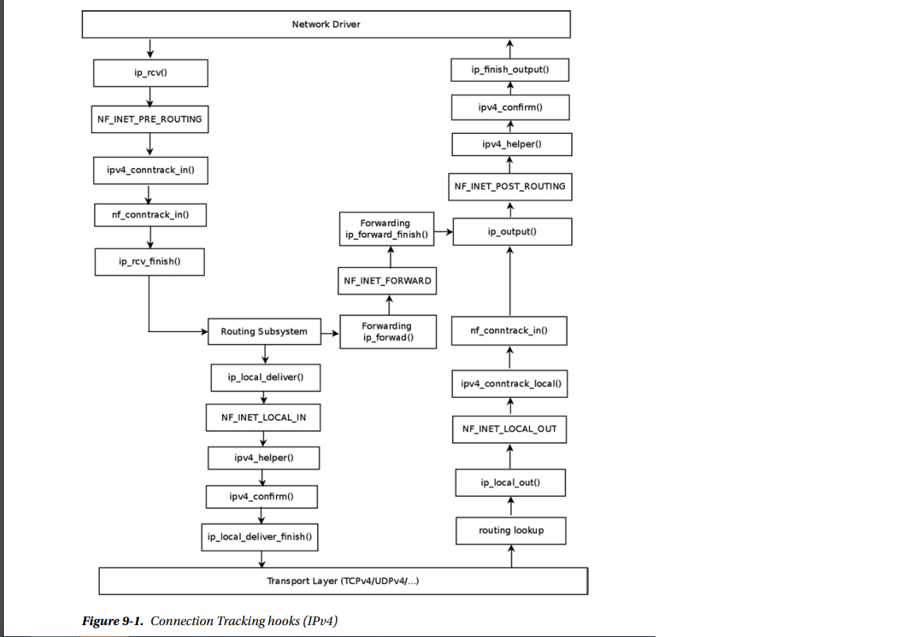

<h1>Netfilter</h1>

1. Netfilter Hooks

    - NF_INET_PRE_ROUTING : 

    - NF_INET_LOCAL_IN :

    - NF_INET_FORWARD : 

    - NF_INET_POST_ROUTING : 

    - NF_INET_LOCAL_OUT : 

- Registration of Netfilter Hooks

To register a hook callback at one of the five hook points mentioned earlier, you first define an nf_hook_ops object and then register it

struct nf_hook_ops {
    struct list_head list;
    /* User fills in from here down. */
    nf_hookfn *hook;
    struct module *owner;
    u_int8_t pf;
    unsigned int hooknum;
    /* Hooks are ordered in ascending priority. */
    int priority;
};

- hook : 
- pf : 
- hooknum : 
- priority : 

There are two methods to register netfilter hooks:

int nf_register_hook(struct nf_hook_ops *reg): Registers a single nf_hook_ops object

int nf_register_hooks(struct nf_hook_ops *reg, unsigned int n): Registers an array of n nf_hook_ops objects

2. Connection Tracking

It is not enough to filter traffic only according to the L4 and L3 headers in modern networks. You should also take into account cases when the traffic is based on sessions, such as an FTP session or a SIP session
For example : the client first creates a TCP control connection on TCP port 21, which is the default FTP port. Commands sent from the FTP client (such as listing the contents of a directory) to the server are sent on this control port. The FTP server opens a data socket on port 20, where the destination port on the client side is dynamically allocated .Traffic should be filtered according to other parameters, such as the state of a connection or timeout. This is one of the main reasons for using the Connection Tracking layer
Connection Tracking allows the kernel to keep track of sessions.The Connection Tracking layer’s primary goal is to serve as the basis of NAT.
The IPv4 NAT module cannot be built if CONFIG_NF_CONNTRACK_IPV4 is not set
The IPv6 NAT module cannot be built if the CONFIG_NF_CONNTRACK_IPV6 is not set
However, Connection Tracking does not depend on NAT .You can run the Connection Tracking module without activating any NAT rule

- Connection Tracking Initialization
    static struct nf_hook_ops ipv4_conntrack_ops[] __read_mostly = {
        {
            .hook = ipv4_conntrack_in,
            .owner = THIS_MODULE,
            .pf = NFPROTO_IPV4,
            .hooknum = NF_INET_PRE_ROUTING,
            .priority = NF_IP_PRI_CONNTRACK,
        },
        {
            .hook = ipv4_conntrack_local,
            .owner = THIS_MODULE,
            .pf = NFPROTO_IPV4,
            .hooknum = NF_INET_LOCAL_OUT,
            .priority = NF_IP_PRI_CONNTRACK,
        },
        {
            .hook = ipv4_helper,
            .owner = THIS_MODULE,
            .pf = NFPROTO_IPV4,
            .hooknum = NF_INET_POST_ROUTING,
            .priority = NF_IP_PRI_CONNTRACK_HELPER,
        },
        {
            .hook = ipv4_confirm,
            .owner = THIS_MODULE,
            .pf = NFPROTO_IPV4,
            .hooknum = NF_INET_POST_ROUTING,
            .priority = NF_IP_PRI_CONNTRACK_CONFIRM,
        },
        {
            .hook = ipv4_helper,
            .owner = THIS_MODULE,
            .pf = NFPROTO_IPV4,
            .hooknum = NF_INET_LOCAL_IN,
            .priority = NF_IP_PRI_CONNTRACK_HELPER,
        },
        {
            .hook = ipv4_confirm,
            .owner = THIS_MODULE,
            .pf = NFPROTO_IPV4,
            .hooknum = NF_INET_LOCAL_IN,
            .priority = NF_IP_PRI_CONNTRACK_CONFIRM,
        },
    };

    The two most important Connection Tracking hooks you register are the NF_INET_PRE_ROUTING hook,
    handled by the ipv4_conntrack_in() method, and the NF_INET_LOCAL_OUT hook, handled by the ipv4_
    conntrack_local() methody. In netfilter hooks, a callback with a lower-priority value is executed first
    Registration of IPv4 Connection Tracking hooks is done by calling the nf_register_hooks() method

    

    The basic element of Connection Tracking is the nf_conntrack_tuple structure :

    struct nf_conntrack_tuple {
        struct nf_conntrack_man src;
        /* These are the parts of the tuple which are fixed. */
        struct {
            union nf_inet_addr u3;
            union {
            /* Add other protocols here. */
                __be16 all;
                struct {
                    __be16 port;
                } tcp;
                struct {
                    __be16 port;
                } udp;
                struct {
                    u_int8_t type, code;
                } icmp;
                struct {
                    __be16 port;
                } dccp;
                struct {
                    __be16 port;
                } sctp;
                struct {
                    __be16 key;
                } gre;
            } u;
            /* The protocol. */
            u_int8_t protonum;
            /* The direction (for tuplehash) */
            u_int8_t dir;
        } dst;
    };
    
- Connection Tracking Entries
    The nf_conn structure represents the Connection Tracking entry:
    struct nf_conn {
        /* Usage count in here is 1 for hash table/destruct timer, 1 per skb,
        plus 1 for any connection(s) we are `master' for */
        struct nf_conntrack ct_general;
        spinlock_t lock;
        /* XXX should I move this to the tail ? - Y.K */
        /* These are my tuples; original and reply */
        struct nf_conntrack_tuple_hash tuplehash[IP_CT_DIR_MAX];
        /* Have we seen traffic both ways yet? (bitset) */
        unsigned long status;
        /* If we were expected by an expectation, this will be it */
        struct nf_conn *master;
        /* Timer function; drops refcnt when it goes off. */
        struct timer_list timeout;
        . . .
        /* Extensions */
        struct nf_ct_ext *ext;
    #ifdef CONFIG_NET_NS
        struct net *ct_net;
    #endif
        /* Storage reserved for other modules, must be the last member */
        union nf_conntrack_proto proto;
    };

    - ct_general :
    - tuplehash : 
    - status :
    - master :
    - timeout : 

- Connection Tracking Helpers and Expectations
Some protocols have different flows for data and for control
For example : FTP, the File Transfer Protocol, and SIP, the Session Initiation Protocol, which is a VoIP protocol. Usually in these protocols, the control channel negotiates some configuration setup with the other side and agrees with it on which parameters to use for the data flow. These protocols are more difficult to handle by the netfilter subsystem, because the netfilter subsystem needs to be aware that flows are related to each other. In order to support these types of protocols, the netfilter subsystem provides the Connection Tracking Helpers

The Connection Tracking Helpers are represented by the nf_conntrack_helper structure. They are registered and unregistered by the nf_conntrack_helper_register() method and the nf_conntrack_helper_unregister() method
3. IPTables
    There are two parts to iptables. The kernel part the core is in net/ipv4/netfilter/ip_tables.c for IPv4, and
    in net/ipv6/netfilter/ip6_tables.c for IPv6
    Each table is represented by the xt_table structure Registration and unregistration of a table is done by the ipt_register_table() and the ipt_unregister_table() methods
    In IPv6, you also use the xt_table structure for creating tables, but registration and unregistration of a table is done by the ip6t_register_table() method and the ip6t_unregister_table() method
4. Network Address Translation (NAT)
    - NAT initialization
    - NAT Hook Callbacks and Connection Tracking Hook Callbacks