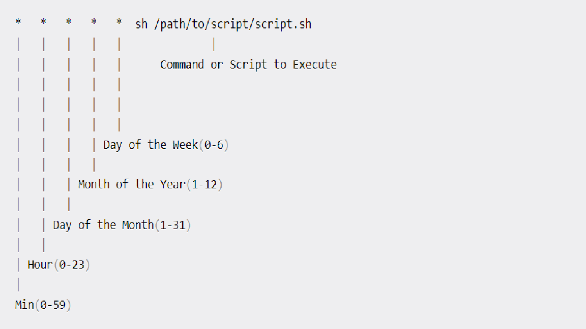

1. How to Create Your First Bash Script

- Create a file named demo.sh
    ```
        touch demo.sh
    ```
- Find the path to your bash shell.
    ```
        which bash
    ```
- Write the command
    ```
        #! usr/bin/bash
        echo "Hello World"
    ```
    Edit the file demo.sh using a text editor of your choice and add the above lines in it.
    ```
        chmod u+x demo.sh
    ```
- Run the script
    ```
        ./demo.sh
    ```
    ```
        bash demo.sh
    ```
2. The Basic Syntax of Bash Scripting

- How to define variables
    ```
        #!/bin/bash
        # A simple variable example
        value1 = Hello
        value2 = Nguyen
        echo $value1 $value2
    ```
- Arithmetic Expressions

    | OPERATOR      | USAGE         |
    | ------------- | ------------- |
    | +             | addition      |
    | -             | subtraction   |
    | *             | multiplication|
    | /             | division      |
    | **            | exponentiation|
    | %             | modulus       |

    var=$((expression))

- How to read user input
    ```
        read variable_name
    ```
- Numeric Comparison logical operators

    | OPERATION             | SYNTAX         |EXPLANATION           |
    | -------------         | -------------  |-----------           |
    | Equality              | num1 -eq num2  | is num1 equal to num2|
    | Greater than equal to | num1 -ge num2  | is num1 greater than equal to num2 |
    | Greater than          | num1 -gt num2  | is num1 greater than num2 |
    | Less than equal to    | num1 -le num2  | is num1 less than equal to num2 |
    | Less than             | num1 -lt num2  | is num1 less than num2 |
    | Not Equal to          | num1 -ne num2  | is num1 not equal to num2 |
    ```
        if [ conditions ]
            then
                commands
        fi
    ```
- Conditional Statements

    ```
        if...then...fi statements
        if...then...else...fi statements
        if..elif..else..fi
        if..then..else..if..then..fi..fi.. (Nested Conditionals)
    ```

    ```
        if [[ condition ]]
        then
            statement
        elif [[ condition ]]; then
            statement 
        else
            do this by default
        fi
    ```
- Looping and skipping
    - Looping with numbers
    ```
        #!/bin/bash
        for i in {1..5}
        do
            echo $i
        done
    ```    
    - Looping with strings
    ```
        #!/bin/bash
        for X in cyan magenta yellow  
        do
            echo $X
        done
    ```
    - While loop
    ```
        #!/bin/bash
        i=1
        while [[ $i -le 10 ]] ; do
        echo "$i"
        (( i += 1 ))
        done
    ```
    - Reading files

        We have a file demo.txt
    ```
        #!/bin/bash
        LINE=1
        while read -r CURRENT_LINE
            do
                echo "$LINE: $CURRENT_LINE"
            ((LINE++))
        done < "demo.txt"
    ```
- How to execute commands with back ticks
    ```
        var= ` commands `
        #!/bin/bash
        var=`df -h | grep tmpfs`    
        echo $var
    ```
- How to get arguments for scripts from the command line
    ``` 
        #!/bin/bash
        for x in $@
        do
            echo "Entered arg is $x"
        done
    ```
    ```
        ./script arg1 arg2
    ```
- How to Automate Scripts by Scheduling via cron Jobs

  

    | SCHEDULE       | SCHEDULED VALUE    |
    | -------------  | -------------      |
    | 5 0 * 8 *      | At 00:05 in August |
    | 5 4 * * 6      | At 04:05 on Sunday |
    | 0 22 * * 1-5   | At 22:00 on every day-of-week from Monday through Friday.  |

- How to Check Existing Scripts in a System
    - Using crontab

        crontab -l lists the already scheduled scripts for a particular user

    - Using the find command
    ```
        find . -type f -name "*.sh"
    ```


