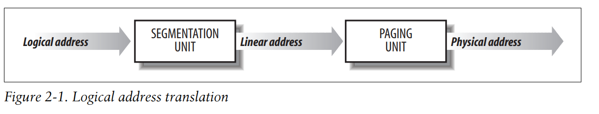

<h1> CHAPTER 2: Memory Addressing </h1>

1. Memory Addresses

    But when dealing with 80 × 86 microprocessors, we have to distinguish three kinds of addresses

    Logical address :
    
    Linear address (also known as virtual address):

    Physical address:

    The Memory Management Unit (MMU) transforms a logical address into a linear address by means of a hardware circuit called a segmentation unit.
    A second hardware circuit called a paging unit transforms the linear address into a physical address 

    

2. Segmentation in Hardware

3. Segmentation in Linux

4. Paging in Hardware

5. Paging in Linuxc